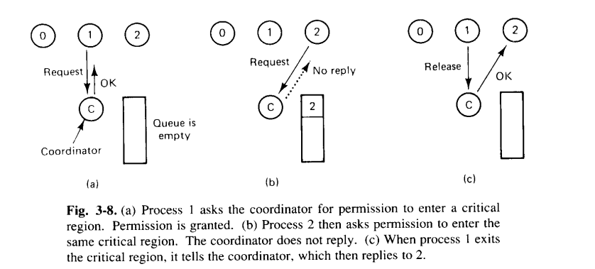
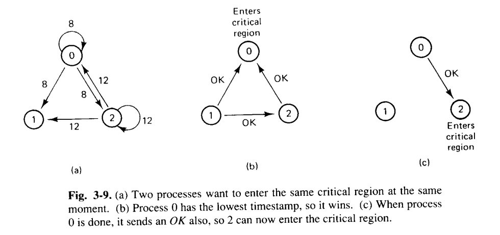
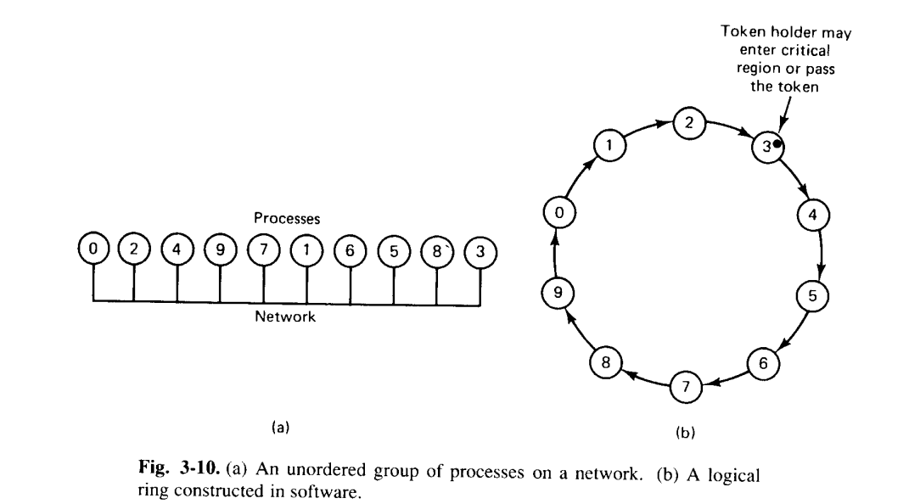
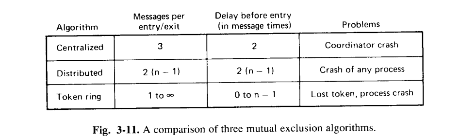
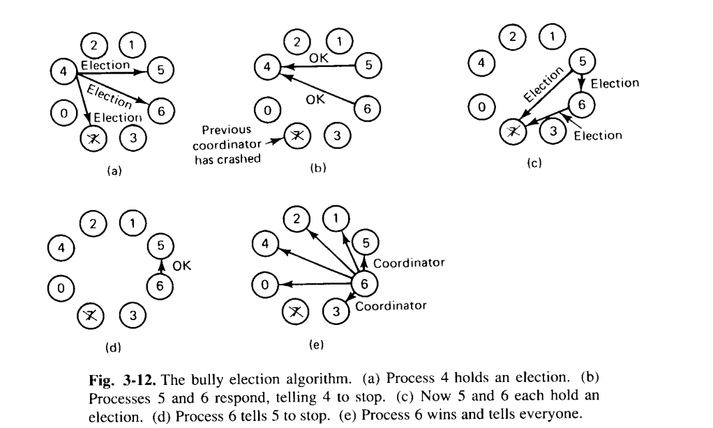
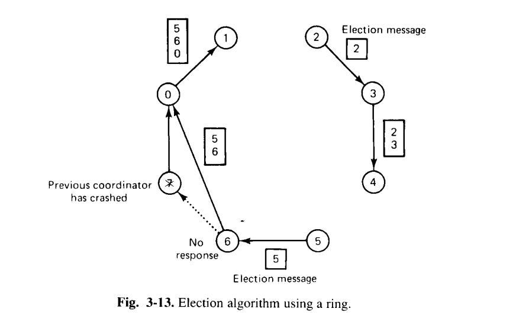
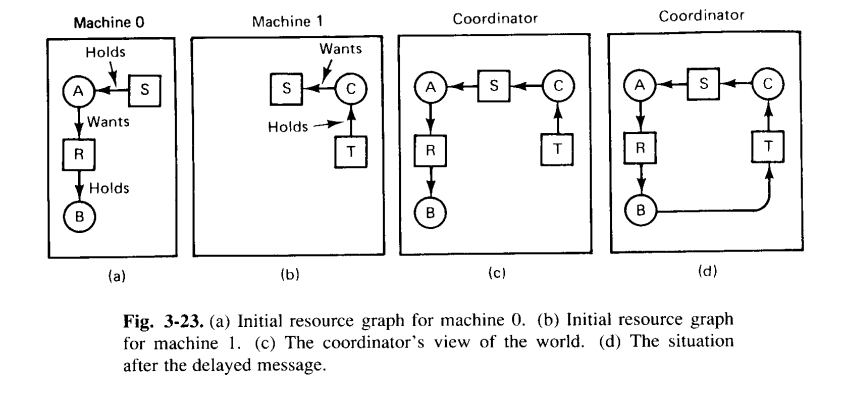
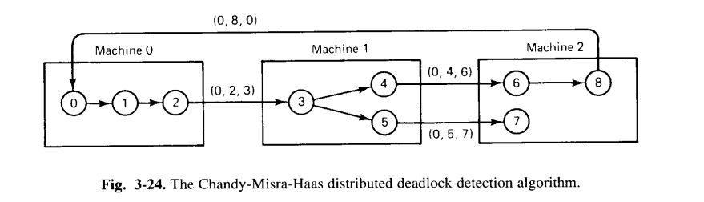

# 分布式系统的同步
## 时钟同步
时钟同步的重要性，以 `make` 为例：`make` 的原理就是将源文件 `input.c` 与输出文件 `output.o` 的最后修改时间进行比较。如果 `output.o` 的最后修改时间时间先于 `input.c`，则源文件发生了更改，需要重新编译。在分布式系统中，如果 `input.c` 文件的时钟略快，可能会导致 `input.c` 发生了更改但 `make` 认为并没有发生更改。

### 逻辑时钟
逻辑时钟是一个相对于“物理时钟”的概念，由 Lamport 提出，指的是分布式系统中各个时钟无需与绝对时间进行同步，只需要保证事件的发生顺序不变即可。
- $a\rightarrow b$: $a$ 在 $b$ 之前发生，包含了两种情况：
	- 如果 $a$ 和 $b$ 是在同一进程中的两个事件，且 $a$ 发生在 $b$ 之前，则 $a\rightarrow b$ 为真；
	- 如果 $a$ 是一个进程发送某个消息的事件，$b$ 为另一个进程接收这个消息的事件，则 $a\rightarrow b$ 为真。
	- 如果 $a$ 和 $b$ 之间不交换信息，则称其为并发关系，谁先谁后不重要。

- 需要一种测量时间的方法 $C()$，使得当 $a\rightarrow b$ 时有 $C(a)\lt C(b)$；另外时间只能前进，不能倒退；只能加上一个值，不能减去一个值；同时任意时间 $a$ 和 $b$，必有 $C(a)\neq C(b)$.

可以看到，消息 C 是在时刻 60 从进程 3 离开，在时刻 56 到达进程 2，这是不可能的。D 同理。因此消息 C 到达进程 2 时，立刻把进程 2 的时钟调为 61。这就是 Lamport 算法。

### 物理时钟

- TAI：International Atomic Time，通过铯133原子跃迁计时，问题是平均太阳日会越来越长，相对地 TAI 就会越来越慢；
- UTC：统一协调时间，引入了“闰秒”的概念；

### 时钟同步算法

TODO

#### Cristian 算法

TODO

#### Berkeley 算法

TODO

#### 平均值算法

TODO

## 互斥

多个进程通常需要使用临界区（critical region）来共享资源。当一个进程需要读写临界区里的数据时，它需要先进入临界区获得[互斥锁](https://en.wikipedia.org/wiki/Mutual_exclusion)（mutual exclusion, mutex）。

### 集中式算法

需要一个进程作为 coordinator

- 优点：没有进程会永远等待（no starvation）；
- 缺点：如果 coordinator 出错，整个系统就会崩溃。

### 分布式算法

- 由 Lamport 提出，Ricart 和 Agrawale 进行改进；
- 要求系统中所有事件的发生顺序必须无歧义；
- 当一个进程想进入临界区时，它需要创建一条包含 *想进入的临界区的名字、处理器id、当前时间* 的消息，然后将消息发送给所有的进程；
- 当进程接收到上述消息后，采取以下几种处理方案：
  - 如果接收者不在临界区也不想进入临界区，则向发送者发送 OK；
  - 如果接收者已经在临界区中，则不需要响应，而是将请求放入队列中；
  - 如果接收者不在临界区但是想进入临界区，那么需要将收到的消息与其他进程的时间戳进行对比，取小的那个。如果收到的消息时间戳最小，则发送 OK；如果接收者本身的时间戳最小，不回复并将请求放入队列中；

- 进程 0 发出时间戳为 8 的消息，进程 2 发出时间戳为 12 的消息（注意都给自己发了一份）；
- 进程 1 不想进入临界区，所以向进程 0 和 2 发送 OK；
- 进程 2 收到进程 0 的消息，对比时间戳后发现进程 0 的时间戳更小，所以向进程 0 发送 OK；
- 进程 0 收到进程 2 的消息，对比时间戳后发现自己更小，所以不回复消息，把进程 2 的请求放到队列中。当进程 0 结束临界区的使用后，会给进程 2 发送 OK；

### 令牌环算法

首先用软件构造进程的逻辑环：

- 进程 0 首先获得 token；
- token 由进程 k 到进程 k+1 依次传递；
- 当进程 k+1 从进程 k 拿到 token 后，检查临界区是否为空。如果为空，则进入临界区，完成操作后将 token 传给下一个进程。一个 token 只能进入一个临界区；
- 如果进程 k+1 不想进入临界区，就直接把 token 往下传；
- 存在问题：令牌环丢失很难检测；

### 三种算法的比较

- 集中式算法中，进出临界区需要三条信息：请求进入、同意进入、退出时释放；
- 分布式算法中，进入临界区需要 $n-1$ 条请求信息，并且需要 $n-1$ 条 OK 信息；
- 令牌环算法：如果所有的进程都想进入临界区，那么令牌每传递一次就会发生一次临界区的进出；如果没有进程想进入临界区，那么 message per entry/exit 就会趋于无穷大；如果一个进程想进入临界区，那么如果令牌刚好在手上，不需要等待就可以进入临界区；也有可能进程刚把令牌传出去，那么就需要 $n-1$ 条信息后才能再回到手上。

## 选举算法

分布式算法往往需要一个 coordinator（比如集中式互斥算法中的 coordinator），选举算法负责产生这个 coordinator。

### 欺负（Bully）算法

由 Garcia-Molina 提出，如果一个进程 P 发现 coordinator 不响应，它就发起选举：

- P 向所有号码比它大的进程发送 ELECTION 消息；
- 如果没有进程相应，则 P 成为 coordinator；
- 如果有进程相应，则响应的进程成为 coordinator；

因为号码最大的未崩溃进程总能选举获胜，所以称其为 Bully 算法。

- 原来的 coordinator 进程 7 崩溃，进程 4 首先意识到了这一点，开始主持选举；
- 进程 4 向进程 5, 6, 7 发送选举消息；
- 进程 5 和 6 响应；
- 现在进程 5 和 6 分别主持选举；进程 5 向进程 6 和 7 发送选举消息；进程 6 向 进程 7 发送选举消息；
- 进程 6 获胜。

### 环算法

- 如果进程发现 coordinator 不响应了，就把包含自身号码的消息沿着环往下发；
- 如果消息无法发给下一个进程，就发给下下个；
- 收到消息的进程把自己的号码放进消息，再往下发；
- 消息绕环一圈后，根据消息中的号码决定新的 coordinator（最大号码的那个进程）以及新的环成员。

## 原子事务

TODO

### 原子事务简介

TODO

### 事务模型

TODO

### 并发控制

TODO

## 死锁

[死锁](https://zh.wikipedia.org/zh-hk/%E6%AD%BB%E9%94%81s)指的是两个以上的进程都在等待对方停止运行让出资源，但是没有一方提前退出的情况。如下图：

P1 拥有资源 R2，还需要资源 R1 才能运行；P2 拥有资源 R1，还需要资源 R2 才能运行；两边都在互相等待而没有一个进程可以执行。

有四种处理死锁的策略：

- 鸵鸟算法（忽略问题）；
- 检测（允许死锁发生，在检测后想办法恢复）；
- 预防（让静态的死锁在结构上不可能发生）；
- 避免（通过仔细地分布资源以避免死锁）；

这里只讨论检测和预防。

### 分布式死锁检测

#### 集中式的死锁检测

1. 最开始，进程 A 拥有资源 S 并请求资源 R，B 拥有资源 R；同时在另外一台机器上，进程 C 拥有资源 T 并请求资源 S；
2. 在 coordinator 眼里的请求关系如图(c)所示，这是一个合法的请求链，因为当进程 B 结束后，资源 R 会被释放，这样 A 就可以进行操作并在操作结束后释放资源 S，最后进程 C 可以开始操作；
3. 如果 B 在释放 R 后请求资源 T，这也是一个合法的操作；机器 0 向 coordinator 发送消息声明其释放 R，机器 1 则告诉 coordinator 进程 B 正在等待资源 T。如果第二条消息先到达了 coordinator，那么 coordinator 眼中的请求链如图(d)所示，会认为发生了死锁。一般将这种现象称为**假死锁**。

#### 分布式的死锁检测

这里介绍 Chandy-Misra-Haas 算法，该算法允许一个进程同时请求多个资源，例如下图的进程 3 同时请求两个资源，这两个资源被进程 4 和 5 占用：

当某个进程等待资源时，将发送一个三元组：*(阻塞的进程，发送消息的进程，接收消息的进程)*：
- 0->1: (0,0,1)
- 1->2: (0,1,2)
- 2->3: (0,2,3)
- 3->4: (0,3,4); 3->5: (0,3,5)
- ...

依此类推，如果消息绕了一圈又回到了阻塞的进程，那么判定系统发生了死锁。两种打破死锁的方法：

- 让最初发送三元组的进程自杀；
- 将每个进程的 id 加到三元组消息的末尾，这样消息会到最初的发送者时，就有完整的环路信息了。这时候可以选出 id 最大的进程，中止 or 令其自杀。

### 分布式死锁预防

仔细设计使得死锁在结构上不可能。

TODO