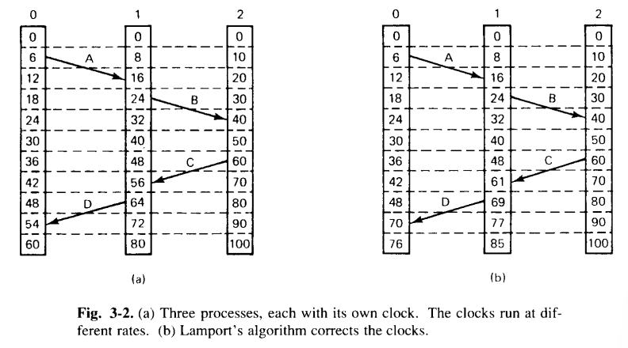

# 分布式系统的同步
## 时钟同步
时钟同步的重要性，以 `make` 为例：`make` 的原理就是将源文件 `input.c` 与输出文件 `output.o` 的最后修改时间进行比较。如果 `output.o` 的最后修改时间时间先于 `input.c`，则源文件发生了更改，需要重新编译。在分布式系统中，如果 `input.c` 文件的时钟略快，可能会导致 `input.c` 发生了更改但 `make` 认为并没有发生更改。

### 逻辑时钟
逻辑时钟是一个相对于“物理时钟”的概念，由 Lamport 提出，指的是分布式系统中各个时钟无需与绝对时间进行同步，只需要保证事件的发生顺序不变即可。
- $a\rightarrow b$: $a$ 在 $b$ 之前发生，包含了两种情况：
	- 如果 $a$ 和 $b$ 是在同一进程中的两个事件，且 $a$ 发生在 $b$ 之前，则 $a\rightarrow b$ 为真；
	- 如果 $a$ 是一个进程发送某个消息的事件，$b$ 为另一个进程接收这个消息的事件，则 $a\rightarrow b$ 为真。
	- 如果 $a$ 和 $b$ 之间不交换信息，则称其为并发关系，谁先谁后不重要。

- 需要一种测量时间的方法 $C()$，使得当 $a\rightarrow b$ 时有 $C(a)<C(b)$；另外时间只能前进，不能倒退；只能加上一个值，不能减去一个值；同时任意时间 $a$ 和 $b$，必有 $C(a)\neq C(b)$.

可以看到，消息 C 是在时刻 60 从进程 3 离开，在时刻 56 到达进程 2，这是不可能的。D 同理。因此消息 C 到达进程 2 时，立刻把进程 2 的时钟调为 61。这就是 Lamport 算法。

### 时钟同步算法

TODO

### Cristian 算法

TODO

### Berkeley 算法

TODO

### 平均值算法

TODO

### 互斥

多个进程通常需要使用临界区（critical region）来共享资源。当一个进程需要读写临界区里的数据时，它需要先进入临界区获得[互斥锁](https://en.wikipedia.org/wiki/Mutual_exclusion)（mutual exclusion, mutex）。

### 集中式算法

### 分布式算法

### 令牌环算法

### 三种算法的比较

